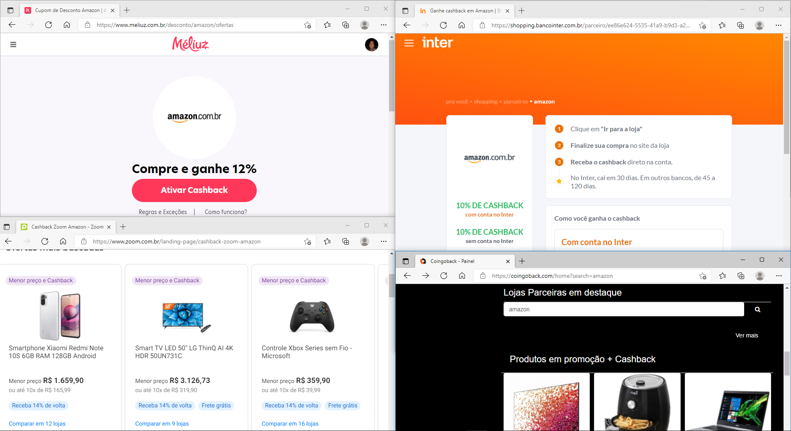

# melhor-cashback

Descubra de forma rápida qual melhor programa de cashback para usar na sua compra!

É o Melhor Cashback!

## Ideia

Tenho [Meliuz](https://www.meliuz.com.br/i/ref_rogeriopradoj?ref_source=2), [Inter Shop](https://shopping.bancointer.com.br/) e mais um monte de programas de serviços de cashback (dinheiro de volta!!!).

E, muitas vezes já sei o que vou comprar, em qual loja, mas...

> Qual o melhor cashback?

Com o Melhor Cashback vamos resolver essa questão!

## Exemplos

### 😌 Com o Melhor Cashback 😌

Fácil, e seguindo o fluxo:

1. Escolho a loja e aperto o botão Melhor Cashback;
1. Pronto! Já inicia o fluxo na melhor opção encontrada!

### 😪 Sem o Melhor Cashback 😪

Vou fazer uma compra na [Amazon.com.br](https://www.amazon.com.br/b?_encoding=UTF8&tag=rogeriopradoj-20&linkCode=ur2&linkId=24533845d0d3abf8c9581362432db893&camp=1789&creative=9325&node=16339926011), e quero ganhar cashback. Qual serviço deveria usar?

Qual dessas 4 opções aqui vale mais a pena?

- [Méliuz: o mais antigo e ainda muito bom!](https://www.meliuz.com.br/i/ref_rogeriopradoj?ref_source=2)
- [Inter Shop: para todo mundo, ainda mais vantajoso para quem tem conta lá!](https://shopping.bancointer.com.br/)
- [Zoom Cashback: esse é novo, e promete retornos agressivos!](https://www.zoom.com.br/cashback-como-funciona)
- [Coingoback: prefere receber em criptomoedas em vez de reais? Aqui é uma opção!](https://coingoback.com/promocoes/68136)

E, no momento da minha consulta aqui, o vencedor foi: Zoom Cashback, 14% prometido.

.

Qual o problema desse caminho? Simples, tive que entrar em cada um dos sites para descobrir qual estava melhor... Bora usar o nosso comparador de cashback!
